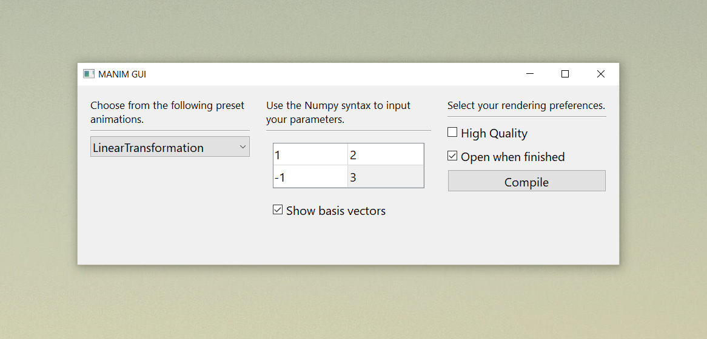

# Manim-gui 

Low-capability GUI for Manim, primarily for generating preset scenes.

# Instructions

1. Clone `manimgui` into your Manim directory.
2. Open `gui.py` and edit the string `DIRECTORY` to reflect your Manim directory.
3. Execute `gui.py`.

# Changelog

### Version 0.1.1 (current): 
- using pathlib now, should work on both Mac and Windows

### Version 0.1.0: 
- initialization
